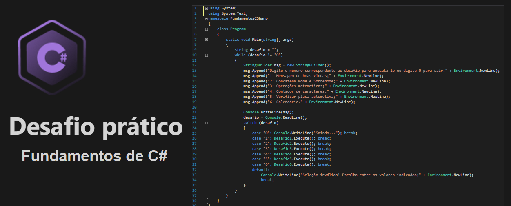

<h1 align="center"> Desafio prático Fundamentos de CSharp</h1>

Este projeto é a resolução do desafio do modulo de Fundamentos de C# da Formação em C#, promovido gratuitamente pela Rocketseat para ensino de tecnologias WEB.  
<a href="https://www.rocketseat.com.br/formacao/csharp" target="_blank">Conheça a Formação completa em C# clicando aqui.</a>

  <a href="#-tecnologias">Tecnologias</a>&nbsp;&nbsp;&nbsp;|&nbsp;&nbsp;&nbsp;
  <a href="#-projeto">Projeto</a>&nbsp;&nbsp;&nbsp;|&nbsp;&nbsp;&nbsp;
  <a href="#-layout">Layout</a>&nbsp;&nbsp;&nbsp;|&nbsp;&nbsp;&nbsp;
  <a href="#memo-licença">Licença</a>

  

 

  

## 🚀 Tecnologias

Esse projeto foi desenvolvido com as seguintes tecnologias:

- C#
- .NET
- Git e Github

## 💻 Projeto

O projeto contém a resolução de 6 tarefas.

## 🔖 Layout

Você pode visualizar as instruções do desafio através [DESSE LINK](https://efficient-sloth-d85.notion.site/Desafio-pr-tico-61b5a711351942bfb2f369351f85990d).

## :memo: Licença

Esse projeto está sob a licença MIT.

---
